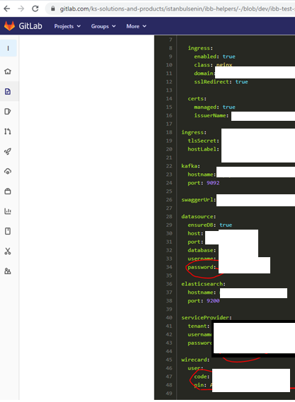
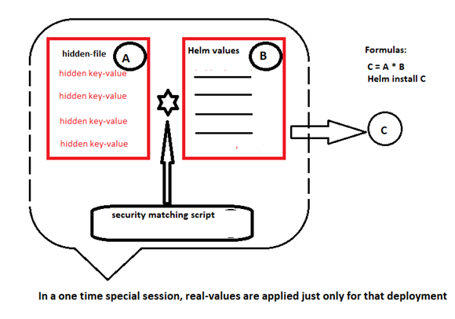

# SensitiveDataProtectionDevSecOpsVision
Sensitive Data Protection for the helm release deployment process and beyond it a DevSecOps vision

Problem:  We are using the helm chart deployment process for the release deployment and, there is a security vulnerability in the helm release deployment process. Charts and their values are kept on the corresponding GitLab repositories. Moreover, their sensitive data values are kept in the related repositories too. 

However, it is not a good security practice. In order to solve this issue, I designed a solution.  This solution consists of a script, a separate hidden file and hidden values in the values yaml file instead of clear text value.
•	Hidden file (Secret key-value file)
•	Helm values file with hidden_values
•	Security script to use corresponding real key-values in a specific session

So, we could use GitLab in a secure way and Helm deployments could be done in a secure manner.  Besides that, we may use this solution as a security automation solution in the pipeline as well. 

Beyond that, as a security vision from the DevSecOps perspective we plan to manage not only this kind of secret data but also all of our (Compnay) sensitive data [password, certificate, secret file, e.g., … ]  on an enterprise level security vault solution. For example: Lastpass, HashiCorp Vault, CyberArk etc. In this way, a secure data can be accessed in authorized way when required without any blocker or losing time. (Sometimes even it is required to reproduce it, due to the not to reach the certificate etc.)
In addition to that, we intend to implement Change Management Procedure to handle enterprise level sensitive data management to add value to whole Company development and deployment processes. 

